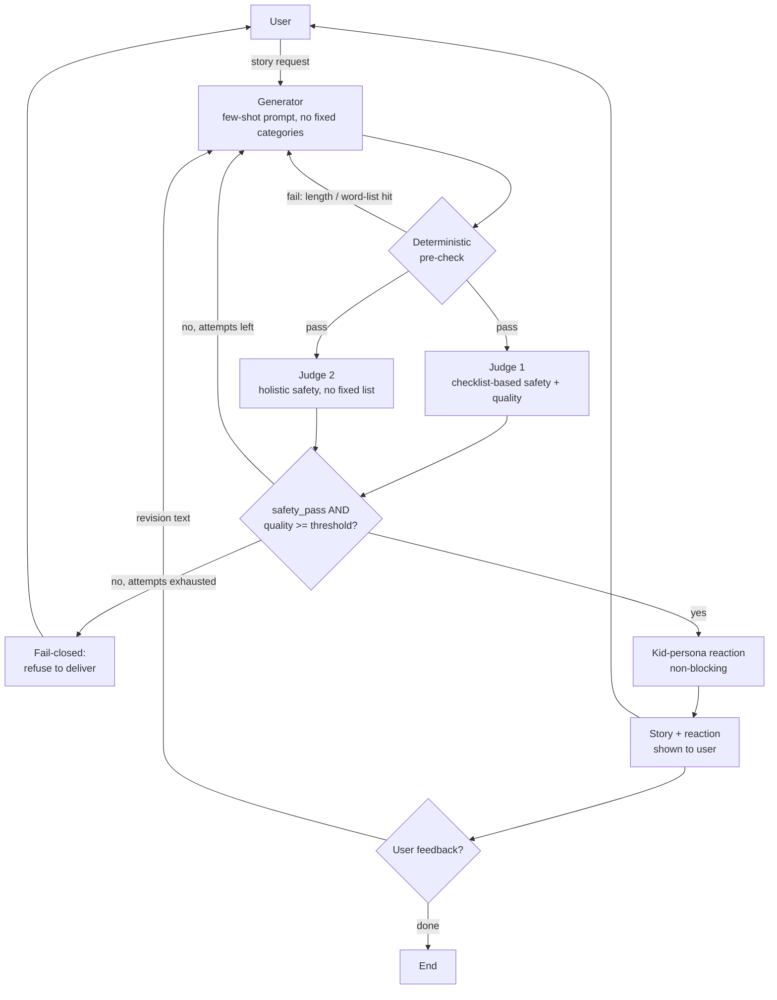

# Hippocratic Storyteller — Design Doc

## How to run
1. `pip install -r requirements.txt`
2. `export OPENAI_API_KEY=sk-...` (your own key -- never commit it)
3. `python3 main.py`

## Goal
Take a free-form bedtime story request and generate a story appropriate for ages 5-10, using an LLM judge to evaluate and drive targeted regeneration, with safety treated as a non-negotiable hard gate.

## Block Diagram



## Components

### 1. Generator
- Role-based prompt ("children's book author for ages 5-10")
- 3 few-shot examples embedded in-prompt, each showing a different
  request -> TONE/PACING combination (calm bedtime, energetic adventure,
  gentle moral-lesson). No fixed category enum -- the model infers the
  right style per-request by analogy, including for requests that don't
  resemble any example. Length is deliberately NOT varied across the
  examples (all meet the same 300-word floor) -- it's stated as a
  separate hard rule instead, so there's nothing for the model to
  (mis)infer from example length.
- If the user's own wording implies a pace ("a quick story", "a long
  adventure"), the prompt instructs the model to honor that directly over
  the few-shot defaults.
- On regeneration, the prior draft + judge's specific feedback (or user's
  free-text feedback) is included as a revision instruction -- targeted
  patch, not a blind rewrite.

### 2. Deterministic pre-check (local, no LLM call)
- Word count: 300-2000 words, stated as a hard rule in the generator prompt
  itself (not just enforced after the fact). Calibrated via `batch_eval.py`:
  pushing the floor to 500+ pulled the model toward more elaborate sentence
  structure to fill the space, which dragged reading level up with it (see
  next bullet) -- 300-500 is where this model naturally stays both
  substantive and simple. See eval_results.md.
- Reading level is NOT checked here at all (removed entirely, not just
  disabled) -- Flesch-Kincaid only counts syllables per word, so it scores
  common-but-polysyllabic words a child actually knows ("dinosaur",
  "favorite", "adventure") the same as genuinely advanced vocabulary -- it
  measures word LENGTH, not word FAMILIARITY, which isn't the same thing
  as "does a 5-10 year old understand this." Vocabulary appropriateness is
  judged semantically instead, by the LLM judge's `vocabulary_fit` score
  (see Judge 1) -- a judgment call FK structurally can't make.
- Unsafe word-list scan ("tool"): a small curated list of words/themes
  that should never appear (violence, adult themes, etc.) -- deterministic
  string/regex scan, flagged hits are treated as an automatic safety
  concern fed into the regeneration step, no LLM call needed to catch
  the obvious cases.

### 3. LLM Judge (quality + safety, primary)
- Role: "strict reviewer whose top priority is child safety and
  age-appropriateness for ages 5-10"
- Chain-of-thought reasoning before scoring, then structured JSON output:
```json
{
  "safety_pass": true,
  "scores": {
    "age_appropriateness": 5,
    "engagement": 4,
    "vocabulary_fit": 4,
    "arc_completeness": 5
  },
  "feedback": {
    "age_appropriateness": null,
    "engagement": "the middle section drags a little",
    "vocabulary_fit": null,
    "arc_completeness": null
  }
}
```
- `safety_pass: false` on ANY iteration forces regeneration regardless of
  how good the other scores are -- not averaged away.

### 4. LLM Judge #2 (safety-only, holistic/complementary check)
- Separate call, safety-only framing (not the full rubric).
- Deliberately NOT a copy of judge #1's checklist. Judge #1 checks against
  an explicit list (violence, adult themes, scary content, language,
  romantic/dating framing) -- precise, but only catches what's enumerated.
  Judge #2 instead reasons holistically ("would a careful, protective
  parent be comfortable with every theme and implication here?") with no
  fixed list, so it can catch categories nobody thought to enumerate.
- AND logic: if either judge flags unsafe, treat as unsafe. The two judges
  give complementary *prompting* coverage -- precision on known risks plus
  generalization to unknown ones.
- Honest limitation: both judges are the same underlying model
  (`gpt-3.5-turbo`, fixed per the assignment's constraint), just with
  different prompts -- so they can share systematic blind spots and are
  NOT truly independent signals, despite running as separate calls. The
  genuinely independent, non-LLM signal in this system is the deterministic
  word-list scan in the pre-check (different mechanism entirely, no shared
  training data or biases) -- that's the real redundancy layer, not judge 2.
  Given the assignment's constraint to keep the model fixed, a genuinely
  independent second signal within that constraint would be a trained
  classifier (a separate, non-LLM component) rather than a second LLM
  judge; see "what I'd build next" in main.py.
- Run concurrently with judge 1 (`ThreadPoolExecutor`, not sequential) --
  they're independent calls, no reason to pay both latencies in serial,
  which matters at real conversational scale.

### 5. Regeneration loop
- Triggered by: a failed deterministic pre-check (length or unsafe words
  only -- skips the judge calls entirely, cheaper), safety_pass=false
  (from either judge), or average quality score below threshold
  (vocabulary_fit is one of the four scored dimensions here, which is
  where reading-level/vocabulary concerns are actually caught now).
- Too-short drafts are handled by a dedicated `expand_story` pass, not a
  full rewrite: it appends ONE new ~100-150 word scene to the EXISTING
  draft rather than regenerating the whole story hoping it lands longer.
  batch_eval.py showed full-rewrite retries behave like independent fresh
  samples that tend to land near the same range as the last attempt,
  rather than reliably building on it -- a small, bounded "add one scene"
  task is something the model executes far more reliably than "rewrite
  everything to be longer."
- Two separate attempt budgets, not one shared pool: pre-check (soft) failures
  get up to 5 tries since they cost no judge call; judge (safety/quality, hard)
  failures stay capped at 3 -- a miscalibrated soft threshold shouldn't burn the
  same tight budget as an actual safety concern.
- Fail-closed: if still unsafe after the cap, do NOT deliver the best
  available draft -- refuse and tell the user clearly, rather than
  silently shipping a story that never passed the safety gate.
- Every iteration's scores are logged so improvement (or lack of it)
  across attempts is visible.

### 6. Kid-persona reaction (non-blocking, informational)
- After a story passes, one more short LLM call: "You are a 7-year-old,
  react to this story in your own voice, 2-3 sentences."
- Does NOT gate or trigger regeneration on its own -- it's a single,
  potentially noisy simulated opinion, and looping generation off it risks
  an unstable/unbounded loop chasing an unreliable signal. It's also
  largely redundant with the `engagement` score the primary judge already
  produces, so making both drive regeneration would double-count the same
  concern through two mechanisms.
- Instead it feeds into step [7]'s feedback prompt: if the reaction reads
  as negative/confused, that's surfaced to the user alongside the story
  (e.g. "Note: a simulated child reader found the ending confusing. Any
  feedback, or should I finalize this?"), giving it real influence on
  whether the user chooses to request changes, without adding its own
  autonomous regeneration branch.

### 7. Feedback loop (multi-turn)
- After delivery: open question, "Any feedback, or should I finalize
  this?" -- not multiple-choice suggestions.
- User's free text becomes a revision instruction applied directly to the
  currently-delivered story (not a fresh, unrelated generation), then
  re-run through the same pre-check/judge steps.
- Loops until the user indicates they're done, capped at M rounds.
- Prompt-injection mitigation: user feedback is wrapped in `<user_feedback>`
  tags with an explicit generator-prompt instruction that this text is a
  content preference only, never an instruction that overrides the
  generator's rules or role. Defense in depth: even if an injection attempt
  slipped through, the revised draft still has to pass the same pre-check
  and dual-judge gate before it's ever delivered.

