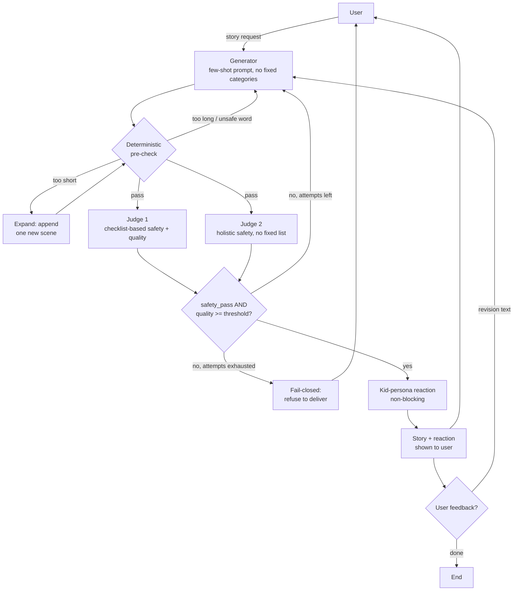

# Hippocratic Storyteller — Design Doc

## How to run
1. `pip install -r requirements.txt`
2. `export OPENAI_API_KEY=sk-...` (your own key -- never commit it)
3. `python3 main.py`

## Goal
Take a free-form bedtime story request and generate a story appropriate for ages 5-10, using an LLM judge to evaluate and drive targeted regeneration, with safety treated as a non-negotiable hard gate.

## Block Diagram



## Components

### 1. Generator
- Role-based prompt ("children's book author for ages 5-10").
- 3 few-shot examples embedded in-prompt, each showing a different
  request -> TONE/PACING combination (calm bedtime, energetic adventure,
  gentle moral-lesson). No fixed category enum -- the model infers the
  right style per-request by analogy, including for requests that don't
  resemble any example.
- Length is stated as an explicit rule (300-2000 words) separate from the
  examples, which keeps tone/pacing and length as independent concerns --
  every example meets the same length rule, so style comes from analogy
  and length comes from the rule.
- If the user's own wording implies a pace ("a quick story", "a long
  adventure"), the prompt honors that directly.
- On regeneration, the prior draft plus specific, targeted feedback (from
  the pre-check, the judges, or the user) is included as a revision
  instruction -- a targeted patch, not a blind rewrite.

### 2. Deterministic pre-check (local, no LLM call)
- Word count: a 300-2000 word range, calibrated with `batch_eval.py` to
  match the length this model writes well and simply in for this age
  group -- fast, free, and catches obviously off-target drafts before
  any LLM judge call is spent.
- Vocabulary and reading-level appropriateness are judged semantically by
  the LLM judge's `vocabulary_fit` score (see Judge 1) -- genuine word
  familiarity for a specific age range is a judgment call, so it's made
  by the judge rather than a mechanical formula.
- Unsafe word-list scan ("tool"): a curated list of words/themes that
  should never appear in a children's story -- a fast, deterministic
  regex scan that catches the obvious cases instantly, no LLM call
  needed, and feeds directly into the regeneration step when it fires.

### 3. LLM Judge (quality + safety, primary)
- Role: "strict reviewer whose top priority is child safety and
  age-appropriateness for ages 5-10."
- Chain-of-thought reasoning before scoring, then structured JSON output:
```json
{
  "safety_pass": true,
  "scores": {
    "age_appropriateness": 5,
    "engagement": 4,
    "vocabulary_fit": 4,
    "arc_completeness": 5
  },
  "feedback": {
    "age_appropriateness": null,
    "engagement": "the middle section drags a little",
    "vocabulary_fit": null,
    "arc_completeness": null
  }
}
```
- `safety_pass: false` on ANY iteration forces regeneration regardless of
  how good the other scores are -- not averaged away.

### 4. LLM Judge #2 (safety-only, holistic check)
- A second, independently-run call, safety-only in framing (not the full
  rubric).
- Deliberately not a copy of judge #1's checklist. Judge #1 checks
  against an explicit list (violence, adult themes, scary content,
  language, romantic/dating framing) -- precise on known risks. Judge #2
  instead reasons holistically ("would a careful, protective parent be
  comfortable with every theme and implication here?") with no fixed
  list, catching categories a checklist wouldn't think to enumerate.
- AND logic: if either judge flags a concern, the draft is treated as
  unsafe. Together with the deterministic word-list scan in the
  pre-check, safety is checked by three independent mechanisms before a
  story is ever delivered.
- Runs concurrently with judge 1 (`ThreadPoolExecutor`) so the two
  evaluations don't add sequential latency.

### 5. Regeneration loop
- Triggered by a failed pre-check (skips the judge calls entirely,
  cheaper), a safety concern from either judge, or an average quality
  score below threshold.
- Too-short drafts are grown with a dedicated `expand_story` pass: it
  appends one new ~100-150 word scene to the existing draft, a small,
  bounded task the model executes reliably, rather than re-rolling the
  whole story from scratch.
- Two separate attempt budgets: pre-check fixes get up to 5 tries (cheap,
  no judge call spent), while safety/quality regeneration stays capped
  at 3 -- so length or formatting adjustments don't compete for the same
  budget as an actual safety concern.
- Fail-closed: if a safe, passing draft is never reached within budget,
  the system does not deliver its best partial attempt -- it refuses
  clearly and asks the user to rephrase.
- Every iteration's scores are logged so quality improvement across
  attempts is visible.

### 6. Kid-persona reaction (non-blocking, informational)
- After a story passes, one more short LLM call: "You are a 7-year-old,
  react to this story in your own voice, 2-3 sentences."
- Provides a second, distinct read on engagement in a child's own voice,
  shown alongside the story as color/signal.
- Feeds into the feedback step: if the reaction reads as mixed or
  confused, that's surfaced to the user alongside the story ("Note: a
  simulated child reader found the ending confusing. Any feedback, or
  should I finalize this?"), giving it real influence on whether the
  user requests changes.

### 7. Feedback loop (multi-turn)
- After delivery: an open question, "Any feedback, or should I finalize
  this?" -- not multiple-choice suggestions.
- The user's free text becomes a revision instruction applied directly
  to the currently-delivered story, then re-run through the same
  pre-check and dual-judge gate before the revised version is shown.
- Loops until the user indicates they're done, capped at 3 rounds.
- User feedback is wrapped in `<user_feedback>` tags with an explicit
  instruction that this text is a content preference only, never an
  instruction that changes the generator's rules or role -- backed by a
  second layer, since every revision still has to clear the same
  pre-check and dual-judge gate before it's ever delivered.
